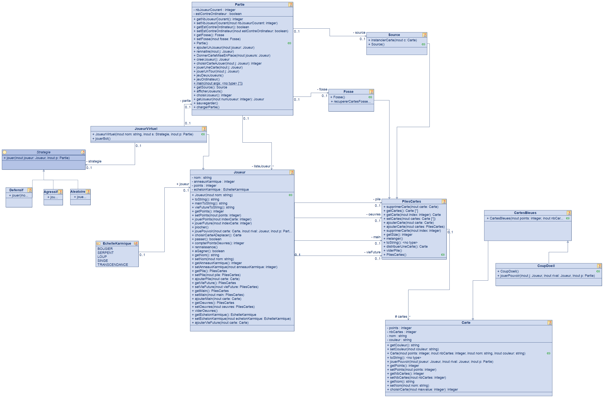
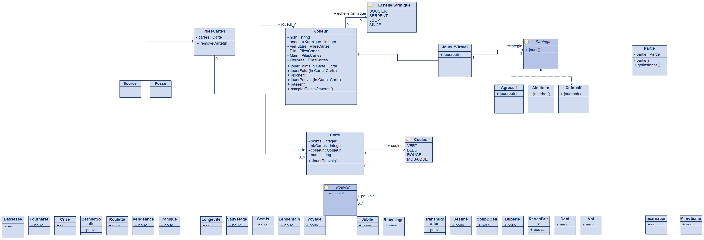

# karmaka_LO02

## Sommaire

- [karmaka\_LO02](#karmaka_lo02)
  - [Sommaire](#sommaire)
  - [Organisation des fichiers](#organisation-des-fichiers)
    - [Dossier modelio](#dossier-modelio)
    - [Dossier karmaka](#dossier-karmaka)
      - [Dossier src](#dossier-src)
      - [Dossier doc](#dossier-doc)
      - [Dossier bin](#dossier-bin)
  - [État actuel de l’application](#état-actuel-de-lapplication)
    - [Fonctionnalités implémentées](#fonctionnalités-implémentées)
    - [Fonctionnalités non implémentées](#fonctionnalités-non-implémentées)
  - [Utilisation de l’application](#utilisation-de-lapplication)
  - [Structure du code](#structure-du-code)
    - [Diagramme de classes](#diagramme-de-classes)
      - [Différences entre le diagramme de classes prévu et le diagramme de classes final](#différences-entre-le-diagramme-de-classes-prévu-et-le-diagramme-de-classes-final)

## Organisation des fichiers

### Dossier modelio

Ce dossier contient les fichiers du projet modelio.

>Utilisé pour la conception du projet, il n'est pas nécessaire pour l'exécution du projet. Il est possible de l'ouvrir avec le logiciel Modelio.
### Dossier karmaka

Ce dossier contient les fichiers du projet java karmaka.

#### Dossier src

Ce dossier contient les fichiers sources du projet java karmaka.

#### Dossier doc

Ce dossier contient la documentation du projet java karmaka.

>Il semble que la documentation des modules n'arrive pas à se générer, voir `package-info.java` pour plus d'informations. (ainsi que `overview.html` n'est pas généré)
#### Dossier bin

Ce dossier contient les fichiers binaires du projet java karmaka.

## État actuel de l’application

### Fonctionnalités implémentées

Les fonctionnalités implémentées sont celles du cahier des charges, nous avons fait le choix de ne pas implémenter les fonctionnalités bonus, soit l'interface graphique.
Soit:
* Un système de sauvegarde et de chargement de partie
* Un mode multijoueur (en 1vs1 ou 1 vs bot)
* Des bots avec des stratégies différentes
  * C'est des pondération de stratégies, les bots ne sont pas intelligents
* Le jeu de base Karmaka des cartes
  * Les pouvoirs des cartes
  * La gestion des cartes et des decks (piles)
  * La réincarnation
  * Détection de la fin de partie
  * Les anneaux karmiques
* ...

### Fonctionnalités non implémentées

* L'interface graphique
* Le mode multijoueur
* Une véritable intelligence artificielle (pour l'instant l'IA joue aléatoirement avec des pondérations différentes pour les stratégies)
* Une gestion des erreurs plus poussée (création d'exceptions spécifiques, etc.)
* Une gestion de la partie plus poussée :
  * Possibilité de sauvegarder une partie plus simplement
  * Affichage amélioré de la partie:
    * Une CLI plus jolie
    * Affichage des cartes jouées par les autres joueurs (actions et cartes)
  * Possibilité de sauvegarder plus d'une partie à la fois
* Certains pouvoirs peuvent être bugués.
* Les pouvoirs pour les bots peuvent être améliorés dans leur implémentation (éviter les `instanceof`)
* Un mode de jeu multijoueur avec plus de 2 joueurs.
* ...

## Utilisation de l’application

Pour lancer l'application, il faut lancer le fichier `Partie.java` dans le package `karmaka.src` et suivre les instructions.

## Structure du code

### Diagramme de classes

Le diagramme de classes final:

Ainsi que le diagramme de classes de Modelio dans le dossier `modelio` (diagramme de classes prévu):

#### Différences entre le diagramme de classes prévu et le diagramme de classes final

* La classe `Partie` n'avait pas été détailée dans le diagramme de classes prévu, elle a été ajoutée dans le diagramme de classes final, ainsi que les relations avec les autres classes:
  * Les classes `Source`, `Fosse`, `JoueurVirtuel` et `Joueur`.
* On n'utilise pas d'interface `Pouvoir`, mais une classe par Couleur de carte.